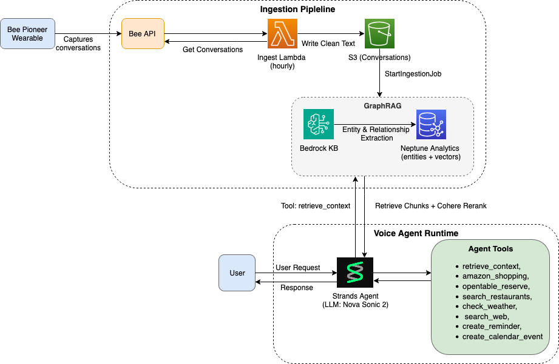
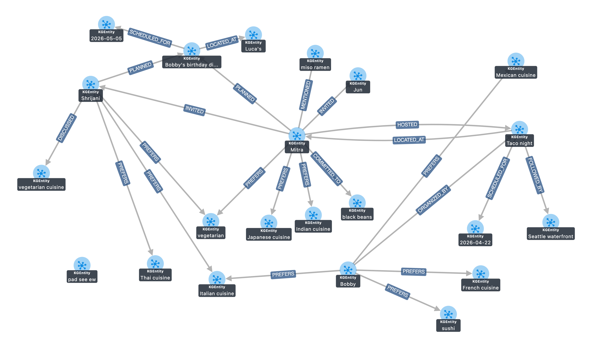

# ContextIQ: Ambient Context Voice Assistant
## Amazon Developer Hackathon 2026

**Team:** Shrijani, Mitravinda, Robert, Jun Hyung Lee

**Tagline:** Turn everyday conversations into instant actions — your voice assistant that was already in the room when you talked about it.

> This is the design and product writeup. For setup, deployment, and operational
> details, see [`README.md`](README.md).

---

## The Problem

Voice assistants like Alexa need context to give you a tailored response or carry out a task — and today that context has to be supplied by you. Alexa personalizes from your Amazon account, your shopping activity, your voice profile, and whatever you've explicitly told it. It is only as good as the context you remember to feed it.

You tell your partner you need milk while making dinner. You promise friends you'll book a Thai place for Friday. You discuss birthday party plans over lunch at the park. By evening, half of it is gone — scattered across conversations you'll never replay.

You have to re-explain context that already exists in conversations you've already had. "Alexa, add milk to my cart" works, but "Alexa, add those groceries we talked about" doesn't — because that conversation happened outside Alexa.

The information exists. The Bee Pioneer wearable already captures it. The gap is connecting ambient conversation data to an agent that can reason about it and take action.

---

## The Solution

**ContextIQ** is a Strands Agent on Bedrock that gives Alexa+ a memory.

When you say "Add those groceries we talked about," the agent already knows what you discussed, confirms the list, and adds items to your Amazon cart. When you say "Help me plan Emma's birthday," it knows Emma prefers Thai food, finds restaurants near the park you mentioned, checks the weather, and offers to book a table.

No repetition. No context-switching. Just: you talked about it, now it's done.

---

## What It Does

Three layers:

**Capture & Index** — The Bee Pioneer wearable captures conversations throughout the day. An hourly Lambda job syncs new transcripts to S3 as clean text (raw ASR noise is intentionally excluded — summaries only, because misheard words hurt retrieval quality). A Bedrock Knowledge Base with GraphRAG indexes the text and automatically extracts entities — people, locations, events, items, preferences, commitments — into a Neptune Analytics knowledge graph.

**Recall & Reason** — When you speak to the Alexa+ interface, the Strands BidiAgent running Nova Sonic 2 always retrieves context first via the `retrieve_context` tool. A single GraphRAG Retrieve does both semantic vector search and automatic graph expansion over the entity relationships Bedrock extracted at ingestion (e.g., pulling in the "Green Lake Park" and "outdoor" chunks connected to "Emma's birthday party"), then reranks the results with Cohere Rerank 3.5 to surface the most relevant conversation context. If the agent needs more information, it calls external tools — weather, web search, restaurant search.

**Act & Track** — The agent confirms what it found, then executes: adds items to your Amazon cart via Playwright browser automation, books restaurants on OpenTable, creates reminders in Todoist, or saves multi-step plans. Completed actions can be written back to the knowledge graph as `KGAction` nodes with status tracking, so the agent doesn't repeat work and can answer "what have I already taken care of?"

---

## Demo Scenarios

### Scenario 1: Grocery Shopping from Memory
**Morning conversation:** *"We should make tacos Tuesday — we need cilantro, limes, and tortillas."*

```
User:   "Alexa, add those groceries we talked about"
Alexa+: "From your conversation earlier, you need cilantro, limes, large tortillas,
         tofu, and shredded cheese for taco night Tuesday at 7:30.
         Should I add those to your Amazon cart?"
User:   "Yes"
Alexa+: "Found organic cilantro bunch at $2.49 and Goya cilantro at $1.99.
         First or second?"
User:   "First one"
Alexa+: "Added to cart. Need the limes too?"
```

### Scenario 2: Weather-Aware Event Planning
**Over lunch:** *"Let's do Emma's birthday party Saturday outdoors at Green Lake — she loves Thai food."*

```
User:   "Alexa, help me plan Emma's birthday party"
Alexa+: "Rain expected Saturday for the outdoor party. Sunday looks clear. Move it?"
User:   "Yes, move to Sunday"
Alexa+: "Party moved to Sunday. Memory shows Emma prefers Thai food.
         Want me to search for restaurants near Green Lake?"
User:   "Yes"
Alexa+: "Found two options near Green Lake Park: Thai Ginger (4.5 stars, $$$)
         and Araya's Place (4.3 stars, vegetarian, $$). First or second?"
```

### Scenario 3: Commitment Tracking
**Phone call with mom:** *"We should plan a family vacation around Wynne's birthday on June 18th."*

```
User:   "What do I need to take care of?"
Alexa+: "Two commitments from recent conversations: plan family vacation
         around June 18th for Wynne's birthday, and pick up prescription
         by Thursday. Want reminders?"
User:   "Yes"
Alexa+: "Reminders set. Need help planning the vacation?"
```

---

## Technical Architecture



### Three-Layer Design

**1. Capture & Index**
- Bee Pioneer wearable captures ambient conversations throughout the day
- Hourly Lambda job syncs new transcripts to S3 as clean text
- Bedrock Knowledge Base with GraphRAG indexes conversations
- Bedrock automatically extracts entities into the Neptune Analytics graph
- Entities: people, locations, events, items, preferences, commitments

**2. Recall & Reason**
- Strands BidiAgent running Nova Sonic 2 retrieves context first via `retrieve_context`
- A single GraphRAG KB Retrieve: semantic vector search + automatic graph expansion
- Over-retrieves 15 chunks, reranks with Cohere Rerank 3.5 down to the top 5
- Calls external tools as needed: weather, web search, restaurant search

**3. Act & Track**
- Agent confirms findings, then executes actions
- Browser automation (Playwright) for Amazon shopping and OpenTable
- Real-time streaming progress during long-running operations
- Writes completed actions back to the knowledge graph as `KGAction` nodes for status tracking

### Context Retrieval

Context is retrieved through a **single path** — the Bedrock GraphRAG knowledge base, whose vector store is one Neptune Analytics graph. A single `Retrieve` call performs semantic vector search plus automatic graph expansion over the entities Bedrock extracts at ingestion, so there is no separate Neptune query at request time. The tool over-retrieves 15 chunks (SEMANTIC) and reranks them with Cohere Rerank 3.5 to the top 5.

An offline knowledge-graph library also maintains custom `KGEntity`/`KGAction` nodes in the same graph for entity tracking and agent write-back. See [`context_engine/docs/agent-context.md`](context_engine/docs/agent-context.md) for the full retrieval strategy.



### Voice Stack

| Component | Technology |
|---|---|
| Voice Model | Amazon Nova Sonic 2 (bidirectional streaming) |
| Agent Framework | Strands Agents SDK — BidiAgent |
| Agent Platform | AWS Bedrock AgentCore |
| Barge-In | Nova Sonic 2 turn detection (HIGH sensitivity) |
| Frontend | React + AWS Cloudscape Design System |
| Audio Processing | AudioWorklet for real-time PCM capture |
| Transport | WebSocket with IAM SigV4 signing |

### Tools

| Tool | Capability | Implementation |
|---|---|---|
| `retrieve_context` | GraphRAG retrieval over Bee data (semantic + graph expansion, reranked) | Bedrock KB (Neptune Analytics vector store) |
| `amazon_shopping` | Search → select → add to cart, streaming progress while the browser works | `playwright-cli` driving a persistent logged-in Chrome profile |
| `opentable_search` | Find restaurants with available reservation slots | OpenTable + Playwright |
| `opentable_select_restaurant` | Pick one restaurant from the search results | OpenTable + Playwright |
| `opentable_reserve` | Hold a specific time slot | OpenTable + Playwright |
| `opentable_confirm_reservation` | Confirm the booking with guest details | OpenTable + Playwright |
| `search_restaurants` | Find nearby restaurants with ratings | Yelp Fusion API |
| `check_weather` | Current weather + forecast | OpenWeatherMap API |
| `search_web` | AI-powered web search | Tavily API |
| `create_reminder` | Task creation with natural language dates | Todoist API |
| `create_calendar_event` | Schedule events in the frontend calendar | Frontend calendar |
| `save_plan_summary` | Persists the agreed plan so later turns don't re-derive it | Knowledge-graph write-back |

---

## What Makes ContextIQ Interesting

### 1. Knowledge Graph as Memory Layer
Standard RAG retrieves text chunks. ContextIQ retrieves **relationships**. It knows that Emma is a person, she prefers Thai food, she's connected to a birthday party event, which is scheduled at Green Lake Park, which is an outdoor location that needs a weather check. One user query triggers a chain of graph traversals that surfaces context no pure vector search would find.

### 2. Agent Write-Back Loop
When the agent adds groceries to your cart, that action is recorded in the graph as a `KGAction` node with status tracking. Next time you ask "what do I still need to do?", the agent knows what's already handled. The knowledge graph isn't just a retrieval layer — it's a living record of your intentions and the agent's actions.

### 3. Proactive Context Awareness
The agent doesn't wait for you to ask about weather. When memory shows an outdoor activity with a specific date, it checks the forecast automatically and surfaces issues first — so if it's going to rain on your picnic, you learn that *before* the agent asks about shopping for ingredients.

### 4. One-Task-Per-Turn Protocol
Voice users can't scan or skim — every word forces real-time processing. Instead of overwhelming users with multiple questions, the agent asks one, waits for confirmation, completes that action, then moves to the next. One clear decision per turn respects cognitive load.

### 5. Real Browser Automation
The Amazon shopping tool doesn't call an API — it actually opens a browser, searches products, lets you pick between options, and adds to your real cart using your logged-in session. This works for services without public APIs and shows how agents can interact with systems designed for humans.

---

## What We Learned

**Technical**
- **GraphRAG:** graph expansion over extracted entities surfaces connected context that vector similarity alone misses — but it only kicks in with a wide enough initial result set, which is why we over-retrieve then rerank.
- **Reranking matters:** raw vector scores at a high result count are nearly flat; Cohere Rerank 3.5 is what actually floats the on-topic chunk to the top.
- **Voice streaming:** Nova Sonic 2's bidirectional streaming with tool use creates seamless voice interactions, including barge-in.
- **Clean input beats complex schemas:** excluding raw ASR transcripts (noise) in favor of summaries measurably improved retrieval quality.

**Design**
- **Memory-first protocol:** always query memory before asking clarification questions — users expect the agent to remember.
- **Confirmation loop:** users trust agents that confirm before taking irreversible actions.
- **Proactive checks:** verifying weather for outdoor events before acting prevents wasted work.

---

## Team

**Shrijani** — ContextIQ agent architecture and system prompt design; context engine Lambda pipeline (Bee API → S3 → Bedrock KB); Bedrock Knowledge Base with GraphRAG configuration; Neptune Analytics graph schema.

**Mitravinda** — Tools implementation (Amazon shopping, OpenTable, weather, web search, reminders); React frontend (Cloudscape-based Alexa+ Simulator); FastAPI voice server with WebSocket streaming; Bee data pipeline and KB retrieval verification; UI/UX and audio processing.

**Robert** — Supporting contributions across architecture and testing.

**Jun Hyung Lee** — Supporting contributions across design.

---

## Technology Stack

- **Bee Pioneer** — Captures and transcribes ambient conversations
- **Amazon Bedrock** — Hosts Nova Sonic 2 and the GraphRAG Knowledge Base
- **Bedrock AgentCore** — Deploys and manages the voice agent runtime
- **Amazon Neptune Analytics** — Knowledge graph and KB vector store
- **Amazon S3** — Clean conversation text with metadata sidecars
- **AWS Lambda + EventBridge** — Hourly Bee API → S3 → KB sync pipeline
- **AWS Secrets Manager** — Bee API credentials
- **AWS CDK** — Infrastructure-as-code for the ingestion pipeline
- **Strands Agents SDK** — Agent orchestration (BidiAgent, `@tool`, system prompt)
- **Amazon Nova Sonic 2** — Bidirectional streaming voice with native tool calling
- **Playwright** — Browser automation for Amazon shopping and OpenTable
- **React + Cloudscape** — Alexa+ Simulator frontend with AudioWorklet PCM capture
- **External APIs** — OpenWeatherMap, Yelp Fusion, Tavily, Todoist, OpenTable

---

**Amazon Developer Hackathon 2026** · Team: Shrijani, Mitravinda, Robert, Jun Hyung Lee

Built with Amazon Nova Sonic 2 · Strands Agents SDK · AWS Bedrock GraphRAG · Neptune Analytics · React · Cloudscape · FastAPI · Playwright · Bee Pioneer
